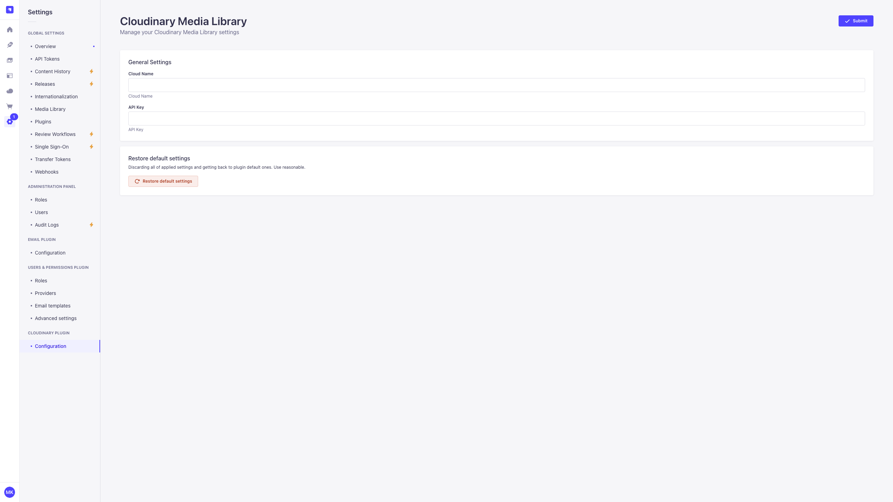
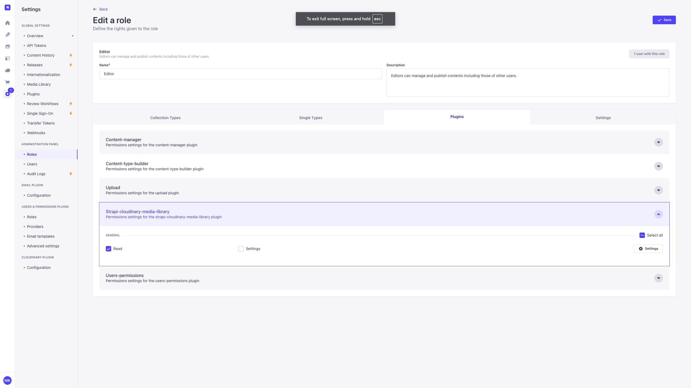

# Strapi Cloudinary Media Library Plugin

A Strapi plugin that adds a **custom field** for selecting Cloudinary media assets using Cloudinary's official Media Library widget.

## 📦 Installation

Install the package from your app root directory

with `npm`

```
npm install strapi-cloudinary-media-library --save
```

or `yarn`

```
yarn add strapi-cloudinary-media-library
```

## 🔐 Getting Cloudinary Credentials

To retrieve your Cloudinary credentials:

- Go to https://cloudinary.com/console
- Select **Settings** > **API keys**
- Copy your cloud name and API key.

You don’t need the API secret for this integration — only cloud name and API key.

## ⚙️ Setting up Configuration File

Your plugin settings should go in `config/plugins.ts`. Here’s an example:

```ts
export default {
  'strapi-cloudinary-media-library': {
    enabled: true,
    config: {
      cloudName: 'your-cloud-name',
      apiKey: 'your-api-key',
      encryptionKey: '32 chars encryption key'
    },
  },
};
```

Additionaly you can set up plugin config through Settings page in the Admin panel. Please note that this configuration will overwrite `config/plugin.ts`



These options are passed directly to the Cloudinary Media Library widget.

## ⚙️ Setting up `strapi::security` middlewares to avoid CSP blocking Cloudinary

When using Cloudinary's Media Library Plugin, modern browsers enforce Content Security Policy (CSP) rules. These policies prevent scripts, images, frames, and other resources from loading if they originate from domains not explicitly allowed — which will cause the Cloudinary widget to break.

To fix this, you need to explicitly allow Cloudinary domains in Strapi's security middleware configuration.

Edit `./config/middlewares.js`

```ts
export default [
  'strapi::logger',
  'strapi::errors',
  {
    name: 'strapi::security',
    config: {
      contentSecurityPolicy: {
        useDefaults: true,
        directives: {
          'connect-src': ["'self'", 'https:'],
          'img-src': [
            "'self'",
            'data:',
            'blob:',
            'https://market-assets.strapi.io',
            'https://console.cloudinary.com',
            'https://res.cloudinary.com',
          ],
          'script-src': [
            "'self'",
            'example.com',
            'https://media-library.cloudinary.com',
            'https://upload-widget.cloudinary.com',
            'https://console.cloudinary.com',
          ],
          'media-src': ["'self'", 'data:', 'blob:', 'https://console.cloudinary.com'],
          'frame-src': [
            "'self'",
            'https://media-library.cloudinary.com',
            'https://upload-widget.cloudinary.com',
            'https://console.cloudinary.com',
          ],
          upgradeInsecureRequests: null,
        },
      },
    },
  },
  'strapi::cors',
  'strapi::poweredBy',
  'strapi::query',
  'strapi::body',
  'strapi::session',
  'strapi::favicon',
  'strapi::public',
];
```

## 🔐 Managing Permissions

The **Strapi Cloudinary Media Library** plugin supports two types of role-based permissions to control access to its features:

| Permission | Description                                                                                                                    |
| ---------- | ------------------------------------------------------------------------------------------------------------------------------ |
| `Read`     | Allows the user to **view Cloudinary credentials** in the Settings page and **upload media** using the Cloudinary input field. |
| `Settings` | Grants full access to **modify** Cloudinary configuration (cloud name and API key).                                            |

### How to manage permissions

1. Go to the **Strapi Admin Panel**.
2. Navigate to **Settings → Administration Panel → Roles**.
3. Select a role (e.g., `Authenticated` or `Super Admin`).
4. Select the **Plugins** section.
5. Find and expand **Strapi-cloudinary-media-library**.
6. Check the permissions you want to enable:
   - `☑ Read`
   - `☑ Settings`
7. Save changes.


